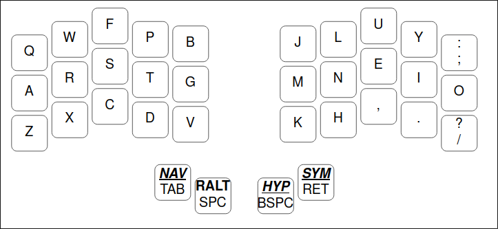
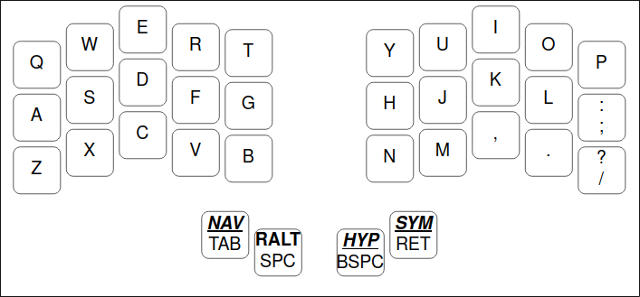
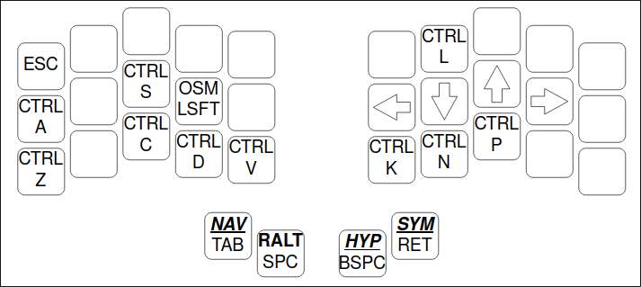
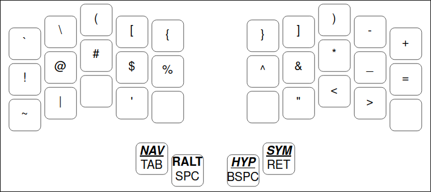
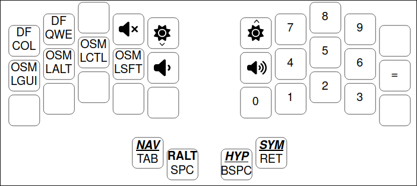
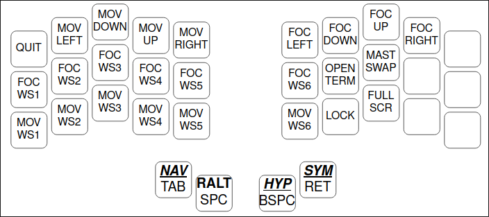

# sioel0 qmk keyboard setup
This is my personal keyboard layout for my Aurora Sweep keyboard from [splitkb](https://splitkb.com).

## Features
This layout is using the following qmk firmware features:
- rgblight which is used as state led, I'm using my liatris microcontroller on board leds, I do not have neither per-key led nor backlight leds.
- oled display to display both layer related info and mods state
- key override to map delete to shift backspace
- caps word which is activated by double left shift
- tri layer to manage my layers easier

## Layers
This layout has 6 different layers:
- Colemak-dh (default layer)

- Qwerty (secondary default layer) toggled as default with a key in the number layer

- Navigation and shortcut layer which has both arrow keys and the most common keyboard shortcuts

- Symbols which contains all the symbols which are not reachable from the default layer

- Numbers which contains both the numpad and some media management keys

- Hyprland which contains the shortcuts that I use the most inside my wm

